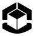
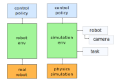

<p align="center">

</p>

# About Gym-Grasping

Gym-Grasping is a package for rapid prototyping of robot control software. It
provides a simulated environment, based on bullet, that can easily be aligned
with a real robot. It does this by separating the environment, robots, and
tasks into sepearate classes. 

Additional tools area also provided for a number of things, including:
1. interfacing with real robots
2. training based on demonstrations
3. calibrating the simulation to observations


<p align="center">

</p>

# Installation

This is a quick instruction on how to install gym-grasping via a conda env.
This installs the project in editable mode, which is easiest for development.
```
# Create conda env
conda create -n bullet  python=3.7
conda activate bullet
pip install -r requirements.txt  # install python dependencies
pip install -r requirements_optional.txt  # if you want, not requried
git checkout master
pip install -e .

python gym_grasping/scripts/simple_test.py  # check if it works.
```

### Install custom Bullet (Optional)

If you want to use EGL, e.g. for training RL try using the following old bullet
version.
```
cd .. # go from gym-grasping root to folder above
git clone https://github.com/BlGene/bullet3.git
cd bullet3
git checkout egl_remove_works
pip install -e .
```

This version has EGL_VISIBLE_DEVICES enabled.


## Install Hardware (Optional)

Get access to robot_io repository and kuka_java_controller_no_ros, then:

```
git clone https://aisgit.informatik.uni-freiburg.de/hermannl/robot_io.git
git clone https://aisgit.informatik.uni-freiburg.de/hermannl/kuka_java_interface_no_ros.git
```
Follow respective READMEs

Currently, it is only necessary to install Intel RealSense SR300, KUKA iiwa and SpaceMouse.

# Introduction

GymGrasping can be used by creating an environment, sending control signals to
this environment and displying information that the environment sends back.
As a starting point for different examples of this being done in for simulated
and real robots please have a look at the following source files.

```
./scripts/grasping_env_test.py -p  # Max's version
./scipts/robot_env_test.py  # Lukas' version
```

Note: these may not be entierly up to date.

Internally GymGrasping has the following structure.

<p align="center">

</p>

The structure is built around a central `Environment` class, compatible with
OpenAI gym. This class contains Robots, with cameras, and tasks. At each
step actions are passed to the robot and task logic is executed.

For traning a policy to complete real world task, we reccomend the following
workflow.

1. Model the enviroment and robot, see `gym_grasping/tasks`.
2. Calibrate robot, see `gym_grasping/calibration`.
3. Train policy, use external algorithms via the gym interface.
4. Execute policy on robot, see `gym_grasping/scripts/real_robot_test.py`


# Development:

## Geometric Conventions

Coordinate conventions:
1. Right hand coordinate system
2. Multiply from left
3. Camera coordinate system on image: +x is right, +y is down, and +z is far
4. Gripper rotation namings: yaw around x, pitch around y, and roll around z
5. Please name variables as follows `T_tcp_flange` to go from TPC <- flange.

Data conventions:
1. Don't use pickle to stored data, use json or np.savez


## Parameters

We implement a curriculum mechanism that creates a schedule for increasing task
difficulty. For this we have chosen a centralized management of randomized
parameters. This is done via the `env_params` varaible that is defined in the
`env.__init__` funciton and passed to those of its member instances that require
it, e.g. robot, camera and task.

In the init function of these variables can be added.  This can be done in
three ways: A) as static variables, randomized ranges can be specified as
either B) center and deviation, or B) lower and upper limits (ll) and (ul).

```
self.env_params.add_variable("sim/frameskip", 4, f=int)  # A
self.params.add_variable("geom/table_pos", center=(0, -0.6, 0.117), d=(0, 0, .001))  # B
self.params.add_variable("vis/block_blue", ll=(.55, .47, .35), ul=(.59, .51, .4), f=hsv2rgb)  # C
```
Where `f` is a post processing function called after sampling.  If a variable
is already defined and needs to be overloaded this can be done via the
`update_variable` function.  Finally there is the option to overwrite the
arguments by passing a dictionary of parameter ranges/values to the init
function via the `param_info` variable.

Note: modules should not require parsing commandline arguments because this can
collide with jupyter-notebook, have a look at `flow_module_IRR.py` to see how
to work around this.

## Style

1. Please use Google style docstrings.
2. Don't use single quotes ` ``` ` as as PyCharm complains

```
"""
This is an example of Google style.

Args:
    param1: This is the first param.
    param2: This is a second param.

Returns:
    This is a description of what is returned.

Raises:
    KeyError: Raises an exception.
"""
```


## How to lint code:
Please try to code according to PEP8 and check your code with lint.
```
pip install pylint
python -m pylint your_current_filename.py --disable=no-member,c-extension-no-member,import-error
```

## How to push to master:
```
(dev) git commit -a -m "..."
(dev) git checkout master
(master) git pull
(master) git checkout dev
(dev) git rebase master
(dev) git mergetool / git checkout master filename
(dev) git rebase --continue
(dev) git push origin dev:master
```


## How to squash commits:
```
git rebase -i HEAD~[num commits]
resolve conflicts
git add -u
git rebase --continue
```

## How to clean git history

The following line clears commited notebook content out of the git history.
```
git filter-branch -f --tree-filter 'find . -name "*.ipynb" -exec nbstripout "{}" +'
```


# Debugging

## Pip Versions

Make sure python and pip versions match, else check pip3

```
# make sure python and pip versions match, else check pip3
echo "Python version is:"; python -V
echo "pip  version is: "; pip -V
```

## Python OpenCV and QT
Note: installing binary opencv can clash with matplotlib (Qt backend IIRC)


# Tips

## How to work with videos:

Converting images -> video:
```
ffmpeg  -i %03d.png video.mp4
ffmpeg -framerate 8 -i %03d.png -r 25  video.mp4
# for browser
ffmpeg -framerate 8 -i %03d.png -r 25 -pix_fmt yuv420p -vf "pad=ceil(iw/2)*2:ceil(ih/2)*2" video.mp4
```

Converting videos -> images:
```
ffmpeg -i video.mp4 -r 8 output_%04d.png
```

Extracting first frame and resize: 
```
ffmpeg -i video.mp4 -vf "select=eq(n\,0)" -q:v 3 video.jpg
convert video.jpg -resize 256x144 video.jpg
```

## Bullet Debug Viewer Keyboard Shortcuts
```
a   draw AABB (only in w mode)
c   draw contacts (only in w mode)
d   no deactivation
j   draw frames
k   draw constraints (only in w mode)
l   draw constraint limits (only in w mode)
w   wireframe
v   visual geometry
g   render grid (i.e. other pannels)
i   pause simulation
o   single step simulation
p   start Timings (saves file)
s   render shadows
F1  Record png images
ESC Exit
```

# 3D Printing

1. Generate mesh files with e.g. AutoCAD export as STL file
2. For intended printer get model, nozzel, material, and calibration files.
3. Convert model to g-code with Cura software
3. Save to SD card
4. Place in printer and start, watch beginning.

The files are on the laptop in `gym-grasping/tasks/3d_print` or `~/Downloads/3d_print`.

Cura is located in `./Downloads/Ultimaker_Cura-4.6.1.AppImage`

Standard Settings:
* Printer: Ultimaker 2 Extended+
* Nozzel: Generic CPE 0.6 mm
* Calibration: petg\_final - Normal - 0.15mm layers & density 20%
